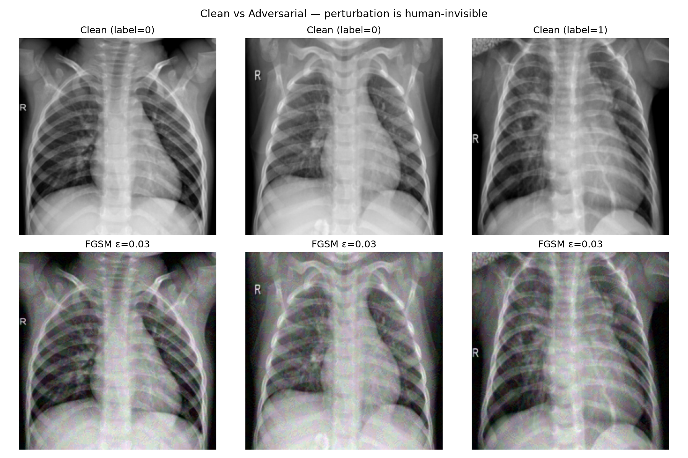
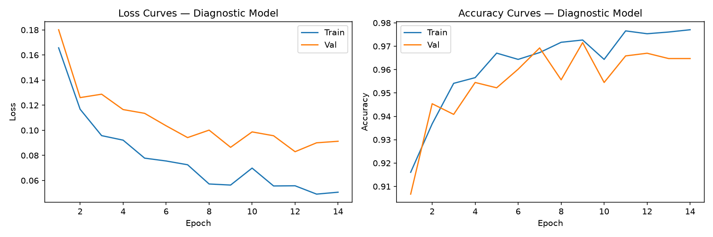
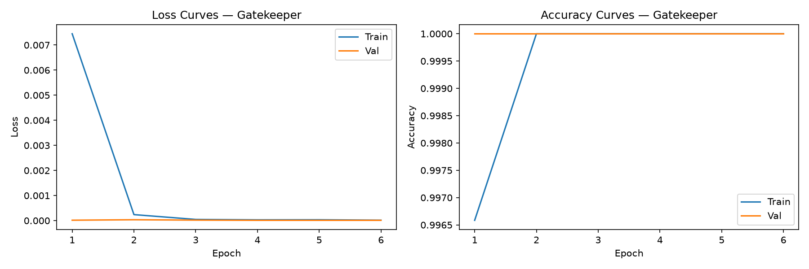
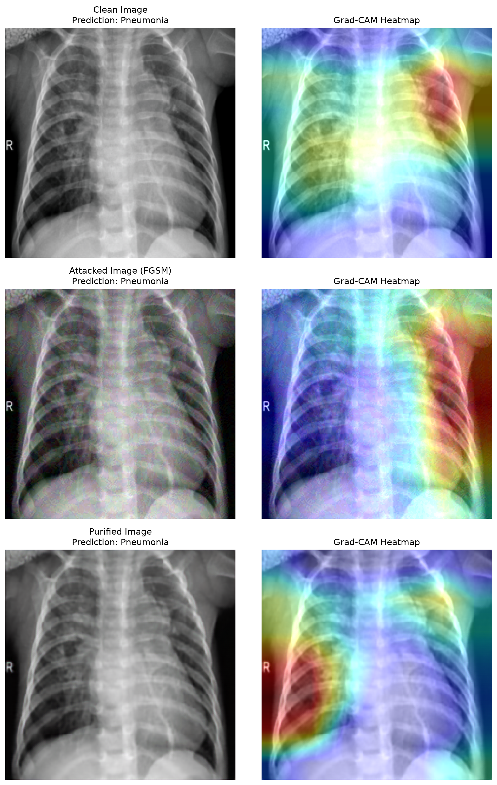

<div align="center">

# 🛡️ AdvShield-Med

### Multi-Attack Adversarial Detection & Defense Framework for Medical Imaging

[](https://www.python.org/downloads/)
[](https://pytorch.org/)
[](https://fastapi.tiangolo.com/)
[](https://react.dev/)
[](LICENSE)

**A pre-inference security layer that detects and neutralizes adversarial attacks on chest X-ray diagnostic models — before they can cause misdiagnosis.**

[Getting Started](#-getting-started) · [Architecture](#-architecture) · [Results](#-results) · [How It Works](#%EF%B8%8F-how-it-works)

</div>

---

## 🎯 The Problem

Deep learning models used for medical diagnosis are dangerously vulnerable to **adversarial attacks** — tiny, human-invisible perturbations that cause catastrophic misdiagnosis:

<div align="center">

| | Clean X-Ray | + Invisible Noise (ε=0.03) |
|---|:---:|:---:|
| **Human Perception** | Normal chest X-ray | Looks identical |
| **AI Diagnosis** | ✅ Correct (96% accuracy) | ❌ Completely wrong (0% accuracy) |

</div>

<div align="center">

<br/>
<em>Top row: clean X-rays. Bottom row: adversarial X-rays (ε=0.03). The noise is imperceptible, but the model's accuracy drops to 0%.</em>
</div>

<br/>

**AdvShield-Med** solves this by wrapping any diagnostic model with a multi-network defense system that inspects, detects, purifies, and only then allows diagnosis — without modifying the original diagnostic model.

---

## 📊 Results

<div align="center">

### Undefended Model Vulnerability

| Attack | ε | Undefended Accuracy | Precision | Recall | F1 |
|:---|:---:|:---:|:---:|:---:|:---:|
| None (Clean) | — | **96.13%** | 98.56% | 96.10% | 0.9731 |
| FGSM | 0.01 | 71.22% | 72.51% | 97.50% | 0.8317 |
| FGSM | 0.03 | 71.33% | 76.18% | 88.30% | 0.8179 |
| PGD-40 | 0.01 | **0.00%** | 0.00% | 0.00% | 0.0000 |
| PGD-40 | 0.03 | **0.00%** | 0.00% | 0.00% | 0.0000 |

### With AdvShield-Med Defense

| Metric | Value |
|:---|:---:|
| Clean image pass-through rate | **100%** (zero false rejections) |
| FGSM attack detection (F1) | **1.000** |
| PGD-40 attack detection (F1) — *unseen during training* | **0.996** |
| Diagnostic recovery after purification (PGD) | **84.2%** (from 0%) |
| Diagnostic recovery after purification (FGSM) | **88.6%** (from 71%) |

</div>

> **Key finding:** The Gatekeeper was trained exclusively on single-step FGSM noise, yet detected **99.2% of unseen 40-step PGD attacks** — demonstrating strong cross-attack generalization without exposure to iterative attacks during training.

<details>
<summary><b>📈 Training Curves</b></summary>
<br/>

**Diagnostic Model — 2-Stage Fine-Tuning**



**Gatekeeper Model — Converges to 100% in 2 epochs**



</details>

<details>
<summary><b>🔍 Grad-CAM Interpretability</b></summary>
<br/>

Visual attention heatmaps showing where the diagnostic model focuses before attack, during attack, and after purification:



*The purified image's attention pattern closely matches the clean image, confirming the U-Net Purifier successfully restores diagnostic feature regions.*

</details>

---

## 🏗️ Architecture

AdvShield-Med orchestrates **4 neural networks** in a runtime pipeline:

```
                         ┌──────────────────────┐
                         │  Input Chest X-Ray   │
                         └──────────┬───────────┘
                                    │
                                    ▼
                    ┌───────────────────────────────┐
                    │   1. Gatekeeper (ResNet-18)   │
                    │   Detects adversarial noise   │
                    └───────────────┬───────────────┘
                                    │
                      ┌─────────────┴─────────────┐
                      ▼                           ▼
                   [CLEAN]                  [ADVERSARIAL]
                      │                           │
                      │                           ▼
                      │              ┌─────────────────────────┐
                      │              │ 2. U-Net Purifier       │
                      │              │ Strips noise, preserves │
                      │              │ anatomical structures   │
                      │              └────────────┬────────────┘
                      │                           │
                      ▼                           ▼
              ┌────────────────────────────────────────────┐
              │      3. Diagnostic Model (ResNet-18)       │
              │      Frozen weights — never modified       │
              └──────────────────┬─────────────────────────┘
                                 │
                                 ▼
                          ┌─────────────┐
                          │  Diagnosis  │
                          │ Normal / PN │
                          └─────────────┘

         4. VGG-16 Perceptual Network (inside Purifier loss function)
```

| # | Network | Architecture | Role |
|:---:|:---|:---|:---|
| 1 | **Gatekeeper** | ResNet-18 | Binary classifier: Clean vs. Adversarial |
| 2 | **Purifier** | U-Net Autoencoder | Image denoiser with skip connections |
| 3 | **Diagnostic** | ResNet-18 (frozen) | Binary classifier: Normal vs. Pneumonia |
| 4 | **Perceptual Evaluator** | VGG-16 (frozen) | Feature extraction for composite loss |

### Dual Operating Modes

- **Strict Rejection:** Adversarial inputs are blocked and flagged for audit. No diagnosis is returned.
- **Sanitize-First:** All inputs pass through the U-Net Purifier before diagnosis. The Gatekeeper score is logged for monitoring.

---

## ⚙️ How It Works

### 2-Stage Transfer Learning

ImageNet-pretrained ResNet-18 models are adapted to chest radiographs using a two-stage protocol to prevent catastrophic forgetting:

| Stage | Trainable Layers | Learning Rate | Epochs | Scheduler |
|:---|:---|:---:|:---:|:---|
| **1 — Head Warmup** | FC head only (512→2) | 1e-3 | 10 | Cosine Annealing |
| **2 — Full Fine-Tuning** | All 11.7M parameters | 1e-5 | 30 | Cosine Annealing → 1e-7 |

Post-training, diagnostic model weights are permanently frozen with runtime `requires_grad` safety assertions.

### Custom Composite Loss for Purification

Standard MSE loss causes blurring that destroys subtle radiological features. The U-Net Purifier is trained with a 3-term composite loss:

```
L_purifier = 1.0 × L_MSE  +  0.5 × (1 - SSIM)  +  0.1 × L_perceptual
             ─────────────    ──────────────────     ────────────────────
             Pixel fidelity   Structural edges       Deep feature match
                              (11×11 Gaussian)       (VGG-16 block2_conv2)
```

| Term | What It Preserves | What Happens Without It |
|:---|:---|:---|
| **MSE** | Overall brightness and color | Output intensity drifts |
| **SSIM** | Bone edges, lung boundaries, local contrast | Image becomes blurry |
| **Perceptual** | High-level diagnostic features (VGG-16) | Disease markers are erased |

### Attack Benchmarking

Three adversarial attack methods are implemented for evaluation:

| Attack | Type | Steps | Budget (ε) |
|:---|:---|:---:|:---|
| **FGSM** | Single-step gradient | 1 | 0.01, 0.03, 0.06 |
| **PGD** | Iterative projected gradient | 40 | 0.01, 0.03, 0.06 |
| **DeepFool** | Minimum-perturbation boundary | 50 | Adaptive |

---

## 📁 Repository Structure

```
advshield-med/
│
├── ml/                           # Core ML framework
│   ├── src/
│   │   ├── models.py             # ResNet-18 builders, freeze/unfreeze utilities
│   │   ├── purifier.py           # U-Net Autoencoder + Composite Loss (MSE+SSIM+VGG)
│   │   ├── pipeline.py           # AdvShieldPipeline orchestration engine
│   │   ├── attacks.py            # FGSM, PGD-40, DeepFool attack harness
│   │   ├── train.py              # Training loop: early stopping, AMP, cosine LR
│   │   ├── data.py               # Stratified data loading & augmentation
│   │   └── evaluate.py           # Metrics: accuracy, precision, recall, F1
│   ├── notebooks/                # Execution scripts (Colab-compatible)
│   │   ├── phase1_baseline.py    # Diagnostic model training
│   │   ├── phase2_attacks.py     # Vulnerability benchmarking
│   │   ├── phase3_gatekeeper.py  # Gatekeeper training + cross-attack test
│   │   ├── phase4_pipeline.py    # End-to-end pipeline integration
│   │   ├── phase5a_purifier.py   # U-Net Purifier training
│   │   └── phase5d_interpretability.py  # Grad-CAM visualizations
│   ├── checkpoints/              # Saved model weights (.pth)
│   └── results/                  # CSV logs, plots, benchmark tables
│
├── backend/                      # FastAPI REST API
│   └── main.py                   # Diagnostic & purification endpoints
│
├── frontend/                     # React 19 + Vite clinical dashboard
│   └── src/
│
├── scripts/                      # Maintenance & utility scripts
├── docker-compose.yml            # Container orchestration
├── requirements.txt
└── LICENSE
```

---

## 🚀 Getting Started

### Installation

```bash
git clone https://github.com/abhinay0804/AdvShield-Med.git
cd AdvShield-Med

python3 -m venv venv
source venv/bin/activate
pip install -r requirements.txt
```

### Dataset

Download the [Kermany Chest X-Ray Dataset](https://www.kaggle.com/datasets/paultimothymooney/chest-xray-pneumonia) and place it at:

```
data/chest_xray/
├── train/
│   ├── NORMAL/
│   └── PNEUMONIA/
├── val/
└── test/
```

### Run the Pipeline

```bash
# Train diagnostic model (Phase 1)
python ml/notebooks/phase1_baseline.py

# Generate adversarial attacks (Phase 2)
python ml/notebooks/phase2_attacks.py

# Train gatekeeper (Phase 3)
python ml/notebooks/phase3_gatekeeper.py

# Evaluate full pipeline (Phase 4)
python ml/notebooks/phase4_pipeline.py
```

### Run the Web Application

```bash
# Terminal 1 — Backend
cd backend && uvicorn main:app --reload --port 8000

# Terminal 2 — Frontend
cd frontend && npm install && npm run dev
```

---

## 🔧 Tech Stack

| Component | Technology |
|:---|:---|
| Deep Learning | PyTorch, torchvision, torchattacks |
| Models | ResNet-18, U-Net, VGG-16 |
| Backend API | FastAPI, Uvicorn |
| Frontend | React 19, Vite, Tailwind CSS |
| Metrics | scikit-learn |
| Experiment Tracking | Weights & Biases (wandb) |
| Deployment | Docker Compose |

---

## 📜 License

This project is licensed under the [MIT License](LICENSE).
